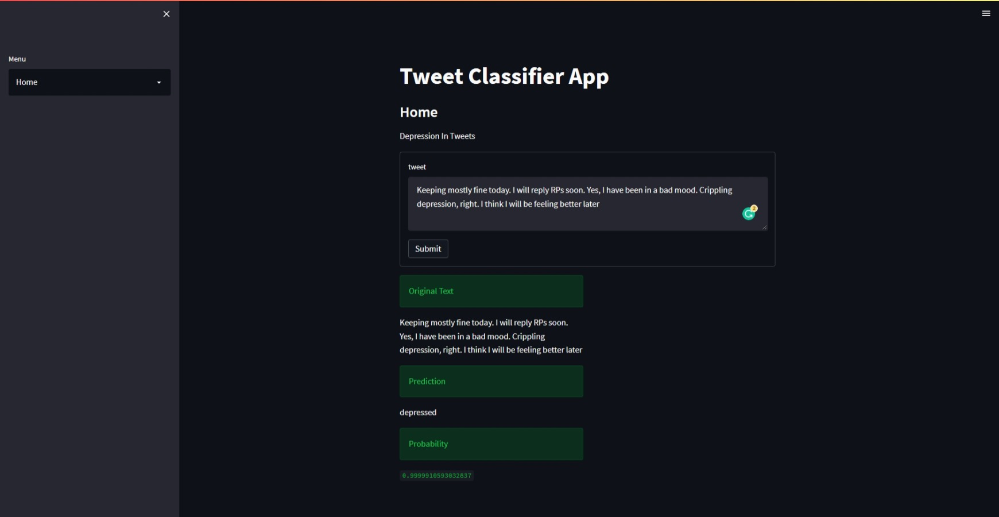

# DL-model-deployment

Model and Dataset - https://drive.google.com/drive/folders/1XYGrlyJjjw2QtIZm3Vk3EQ-NLbv8UE7k?usp=sharing

# Running backend

From source folder
```
uvicorn fastapi_dl_deploy:app --reload
```

# Run streamlit frontend

From source folder
```
streamlit run steamlit_app.py
```

# Screenshot

